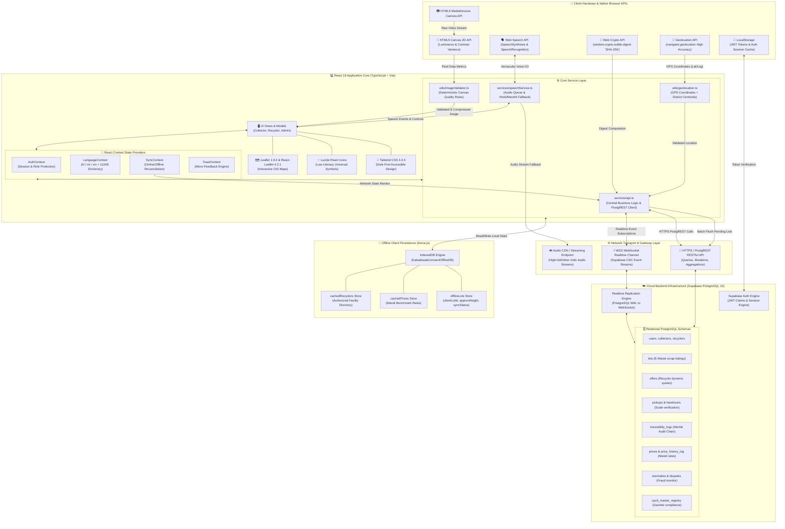

# 🛠️ Tech Stack & Technical Architecture Specification
## Project: Kabadiwala Connect (कबाड़ीवाला कनेक्ट)
**Smart India Hackathon 2026 — Problem Statement #229**  
*Formalizing Informal Scrap Collectors through Vernacular Multimodal Interfaces, Offline-First Resilience, and Cryptographic Traceability.*

---

## 📑 Table of Contents
1. [Tech Stack Matrix (Overview)](#1-tech-stack-matrix-overview)
2. [Visual Architecture Diagrams & Flowcharts](#2-visual-architecture-diagrams--flowcharts)
   - [2.1 End-to-End Operational Workflow Flowchart](#21-end-to-end-operational-workflow-flowchart)
   - [2.2 Tech Stack Interaction Architecture](#22-tech-stack-interaction-architecture)
   - [2.3 Complete Multi-Tier System Architecture](#23-complete-multi-tier-system-architecture)
3. [Frontend & Client Runtime](#3-frontend--client-runtime)
4. [Styling, Design System & Accessibility UI](#4-styling-design-system--accessibility-ui)
5. [Offline-First & Local Storage Engine](#5-offline-first--local-storage-engine)
6. [Cloud Backend & Realtime Database](#6-cloud-backend--realtime-database)
7. [Multimodal Vernacular Voice Engine](#7-multimodal-vernacular-voice-engine)
8. [Computer Vision & Image Quality Pipeline](#8-computer-vision--image-quality-pipeline)
9. [Cryptographic Audit Ledger (SHA-256 Merkle Chain)](#9-cryptographic-audit-ledger-sha-256-merkle-chain)
10. [GIS, Mapping & Geolocation Services](#10-gis-mapping--geolocation-services)
11. [Anti-Fraud & Statistical Anomaly Engine](#11-anti-fraud--statistical-anomaly-engine)
12. [Development & Build Tooling](#12-development--build-tooling)
13. [Empirical Field Research & Unit-Economics Dossier (SIH Mandate)](#13-empirical-field-research--unit-economics-dossier-sih-mandate)

---

## 1. Tech Stack Matrix (Overview)

| Layer | Technology | Version | Primary Responsibility in Kabadiwala Connect |
| :--- | :--- | :--- | :--- |
| **Core Framework** | [React](https://react.dev/) | `^18.2.0` | Declarative, component-based UI rendering with Concurrent Mode |
| **Language** | [TypeScript](https://www.typescriptlang.org/) | `^5.2.2` | Strict end-to-end type safety across domain models and API contracts |
| **Build Tool & Bundler** | [Vite](https://vitejs.dev/) | `^5.2.0` | Ultra-fast HMR dev server and ES module-based production bundling |
| **Routing** | [React Router DOM](https://reactrouter.com/) | `^6.23.0` | Declarative client-side routing with role-based route protection |
| **Styling** | [Tailwind CSS](https://tailwindcss.com/) | `^3.4.3` | Utility-first, responsive dark-mode styling with accessible touch targets |
| **Iconography** | [Lucide React](https://lucide.dev/) | `^0.378.0` | Low-literacy iconography for universal vernacular recognition |
| **Local Offline DB** | [Dexie.js](https://dexie.org/) | `^4.0.7` | IndexedDB wrapper for zero-connectivity offline lot creation and caching |
| **Cloud BaaS & DB** | [Supabase](https://supabase.com/) | `^2.116.0` | PostgreSQL 15, PostgREST API Gateway, Auth and Realtime WebSockets |
| **GIS & Maps** | [Leaflet](https://leafletjs.com/) + [React-Leaflet](https://react-leaflet.js.org/) | `^1.9.4` / `^4.2.1` | Interactive scrap cluster maps, recycler routing, and geofence verification |
| **Voice & Speech** | Native Web Speech API | Native | Bilingual SpeechSynthesis (TTS) and SpeechRecognition (STT) |
| **Media & Canvas** | HTML5 Canvas 2D API | Native | Client-side image luminance/blur quality validation and JPEG compression |
| **Cryptography** | Web Crypto API (`SubtleCrypto`) | Native | SHA-256 cryptographic Merkle Chain linking for EPR compliance logs |
| **Micro-Interactions** | [canvas-confetti](https://www.npmjs.com/package/canvas-confetti) | `^1.9.4` | Milestone celebration feedback upon completed digital transactions |

---

## 2. Visual Architecture Diagrams & Flowcharts

### 2.1 End-to-End Operational Workflow Flowchart
This flowchart details the step-by-step lifecycle of an e-waste scrap lot from initial capture by an informal collector to digital scale verification, instant digital ledger settlement, and CPCB EPR credit generation:

```mermaid
flowchart TD
    classDef actor fill:#1e293b,stroke:#3b82f6,stroke-width:2px,color:#fff;
    classDef action fill:#0f172a,stroke:#10b981,stroke-width:2px,color:#fff;
    classDef decision fill:#312e81,stroke:#818cf8,stroke-width:2px,color:#fff;
    classDef crypto fill:#451a03,stroke:#f59e0b,stroke-width:2px,color:#fff;
    classDef storage fill:#064e3b,stroke:#34d399,stroke-width:2px,color:#fff;

    %% ACTORS
    Collector["👤 Informal Collector (Kabadiwala)"]:::actor
    Recycler["🏭 Authorized Recycler"]:::actor
    Admin["🛡️ CPCB Admin / Regulator"]:::actor

    %% PHASE 1: LOGIN & LANGUAGE
    Collector --> AuthStep["1. Mobile OTP Authentication"]:::action
    AuthStep --> LangSelect["2. Select Language (Hindi / Marathi / English) + Voice Assistance"]:::action

    %% PHASE 2: LOT CREATION & QUALITY VALIDATION
    LangSelect --> AddLot["3. Create New E-Waste Lot"]:::action
    AddLot --> PhotoCapture["4. Capture Scrap Photo via Device Camera"]:::action
    PhotoCapture --> CanvasVal{"5. Canvas Image Quality Check<br/>(Luminance & Blur Edge Variance)"}:::decision
    CanvasVal -- "Photo Too Dark / Blurred" --> RetakePhoto["Voice Guidance: Prompt to Retake Photo"]:::action
    RetakePhoto --> PhotoCapture
    CanvasVal -- "Photo Clear & Sharp" --> ImgCompress["6. In-Browser JPEG Compression (&lt; 500KB)"]:::action

    %% PHASE 3: ML HEURISTIC & OFFLINE CHECK
    ImgCompress --> MLHeuristic["7. Client-Side Edge Classification (PCB, Battery, Cable, etc.)"]:::action
    MLHeuristic --> WeightInput["8. Enter Estimated Weight (kg)"]:::action
    WeightInput --> NetCheck{"9. Internet Connection Available?"}:::decision

    NetCheck -- "OFFLINE" --> DexieSave["Save to IndexedDB (Dexie) with Status 'PENDING'"]:::storage
    DexieSave --> BackgroundWorker["15s Background Sync Worker (Flushes to Cloud when Online)"]:::action
    BackgroundWorker --> CloudLot

    NetCheck -- "ONLINE" --> CloudLot["10. Register Lot in Supabase Cloud PostgreSQL"]:::storage

    %% CRYPTO GENESIS
    CloudLot --> GenesisMerkle["11. SHA-256 Merkle Chain: Genesis Event Hash Logged"]:::crypto

    %% PHASE 4: PRICE DISCOVERY & RECYCLER MATCHING
    CloudLot --> MandiBoard["12. View Live Mandi Benchmark Rates (Daily Spot Prices)"]:::action
    CloudLot --> MatchEngine["13. Explainable Multi-Criteria Recycler Matching<br/>(Distance + Rate + CPCB Auth + Doorstep Pickup)"]:::action
    
    %% PHASE 5: RECYCLER OFFERS
    MatchEngine --> NotifyRecycler["14. Realtime Notification to Nearby Recyclers"]:::action
    NotifyRecycler --> Recycler
    Recycler --> ReviewLot["15. Recycler Inspects Lot & Photo Evidence"]:::action
    ReviewLot --> SubmitBid["16. Submit Dynamic Quote (Rate ₹/kg + Pickup Slot)"]:::action
    SubmitBid --> CompareOffers["17. Collector Compares Competing Offers"]:::action
    CompareOffers --> AcceptOffer["18. Collector Accepts Best Quote"]:::action

    AcceptOffer --> CryptoEvent2["19. Merkle Event: 'OFFER_ACCEPTED' Hash Chained"]:::crypto

    %% PHASE 6: PICKUP & DISPATCH
    AcceptOffer --> SchedulePickup["20. Doorstep Pickup Scheduled (Vehicle & Driver Assigned)"]:::action
    SchedulePickup --> OTPGen["21. 4-Digit Handover OTP Generated on Collector's Device"]:::action
    SchedulePickup --> DriverArrive["22. Logistics Driver Arrives at Collector's Location"]:::action

    %% PHASE 7: WEIGHING & HANDOVER
    DriverArrive --> CalibratedScale["23. Calibrated Electronic Scale Weighing (Actual Weight kg)"]:::action
    CalibratedScale --> WeightComp{"24. Scale Weight Discrepancy Check<br/>(Variance &gt; 15%?)"}:::decision

    WeightComp -- "Variance &gt; 15%" --> AnomalyFlag["⚠️ Auto-Flag Weight Anomaly -&gt; Admin Alert"]:::action
    WeightComp -- "Normal Variance (&lt;=15%)" --> VerifyOTP["25. Driver Inputs Collector's 4-Digit OTP"]:::action

    AnomalyFlag --> VerifyOTP
    VerifyOTP --> CaptureEvidence["26. Capture Scale Reading Photo + Browser GPS Tagging"]:::action
    CaptureEvidence --> Settlement["27. Instant Digital Settlement Voucher (Cash / UPI Passbook)"]:::action

    Settlement --> CryptoEvent3["28. Merkle Event: 'RECYCLER_RECEIVED' Hash Chained"]:::crypto
    Settlement --> LedgerCredited["29. Payout Recorded in Collector's Earnings Ledger"]:::action

    %% PHASE 8: PROCESSING & EPR
    Recycler --> SafeDismantling["30. Scientific Segregation, Dismantling & Material Recovery"]:::action
    SafeDismantling --> EPRCertificate["31. Generate CPCB Green EPR Credit Certificate"]:::action
    EPRCertificate --> FinalMerkle["32. Merkle Event: 'RECYCLED' Milestone Closed"]:::crypto

    %% PHASE 9: ADMIN & AUDIT
    Admin --> CPCBCheck["33. Verify Recycler Against Official CPCB Master Registry"]:::action
    Admin --> GeoMap["34. Monitor Live E-Waste Flow GIS Clusters & Heatmap"]:::action
    Admin --> ResolveDisputes["35. Arbitrate Anomalies & Price/Weight Disputes"]:::action
    Admin --> ExportML["36. Export Anonymized ML Training Datasets"]:::action
```



---

### 2.2 Tech Stack Interaction Architecture
This diagram illustrates how client hardware APIs, React state providers, local offline storage, transport protocols, and cloud services communicate:



---

### 2.3 Complete Multi-Tier System Architecture
A holistic view of all 6 architectural tiers spanning client devices, local edge cache, secure gateways, PostgreSQL database tables, and statutory compliance systems:

```mermaid
graph TD
    classDef clientTier fill:#0f172a,stroke:#38bdf8,stroke-width:2px,color:#fff;
    classDef logicTier fill:#1e1b4b,stroke:#818cf8,stroke-width:2px,color:#fff;
    classDef storageTier fill:#064e3b,stroke:#34d399,stroke-width:2px,color:#fff;
    classDef apiTier fill:#3b0764,stroke:#c084fc,stroke-width:2px,color:#fff;
    classDef backendTier fill:#14532d,stroke:#4ade80,stroke-width:2px,color:#fff;
    classDef complianceTier fill:#7c2d12,stroke:#fb923c,stroke-width:2px,color:#fff;

    subgraph Tier1 ["TIER 1: PRESENTATION & CLIENT APPLICATION TIER"]
        direction TB
        Devices["📱 End-User Devices: Low-end Android Smartphones, Tablets, Desktop Web Browsers"]:::clientTier
        
        subgraph Portals ["Role-Guarded Dashboards & Responsive Shells"]
            CollectorPortal["👤 Collector Portal<br/>• Voice & Visual Scrap Listing<br/>• Live Mandi Benchmark Board<br/>• Explainable Recycler Comparison<br/>• Earnings Passbook Ledger<br/>• Occupational Safety Center"]:::clientTier
            RecyclerPortal["🏭 Recycler Portal<br/>• Incoming Lots Feed<br/>• Dynamic Quote Submission<br/>• Logistics & Driver Dispatch<br/>• Digital Scale & OTP Handover<br/>• Inventory Processing & Yield"]:::clientTier
            AdminPortal["🛡️ Admin & Regulatory Portal<br/>• CPCB Recycler Verification<br/>• GIS Scrap Heatmaps & Clusters<br/>• Weight & Price Anomaly Monitor<br/>• Dispute Arbitration<br/>• ML Dataset Exporter"]:::clientTier
        end
    end

    subgraph Tier2 ["TIER 2: CLIENT LOGIC, MULTIMODAL & UTILITIES ENGINE"]
        direction TB
        StateEngine["🧠 State Orchestration: AuthContext, LanguageContext, SyncContext, ToastContext"]:::logicTier
        SpeechSubsystem["🎙️ Multimodal Voice Engine: SpeechService (Hindi/Marathi TTS, STT, Devanagari Normalizer)"]:::logicTier
        VisionSubsystem["📷 Vision & Compression Engine: ImageValidator (Luminance & Edge Variance) + ImageCompressor (&lt;500KB)"]:::logicTier
        GeoSubsystem["📍 Geolocation Engine: Geolocation Provider (GPS Accuracy + Regional Centroids)"]:::logicTier
        CryptoSubsystem["🔐 Cryptographic Engine: SHA-256 Web Crypto Merkle Chain Generator"]:::logicTier
    end

    subgraph Tier3 ["TIER 3: EDGE RESILIENCE & OFFLINE PERSISTENCE TIER"]
        direction TB
        DexieEngine["💾 Dexie.js (IndexedDB Native Wrapper)"]:::storageTier
        OfflineQueue["📤 Offline Sync Queue with ClientLotID Idempotency Keys"]:::storageTier
        LocalCache["📦 Edge Cache: Mandi Benchmark Rates, Verified Recyclers Directory, User Profile"]:::storageTier
    end

    subgraph Tier4 ["TIER 4: SECURE GATEWAY & TRANSPORT TIER"]
        direction TB
        SupabaseClient["⚡ @supabase/supabase-js Client Gateway"]:::apiTier
        RESTChannel["📡 HTTP/2 HTTPS RESTful API (PostgREST Automated Endpoints)"]:::apiTier
        RealtimeChannel["⚡ WSS WebSocket Pub/Sub (PostgreSQL CDC / Realtime WAL Replication)"]:::apiTier
    end

    subgraph Tier5 ["TIER 5: CLOUD DATABASE & APPLICATION BACKEND TIER"]
        direction TB
        subgraph PostgresDB ["🐘 Supabase Cloud PostgreSQL 15 Engine"]
            TablesCore["📋 Identity & Profiles:<br/>• public.users<br/>• public.collectors<br/>• public.recyclers"]:::backendTier
            TablesLots["📦 Transaction Core:<br/>• public.lots<br/>• public.offers<br/>• public.pickups<br/>• public.handovers"]:::backendTier
            TablesAudit["⛓️ Audit & Financial Ledger:<br/>• public.traceability_logs (Merkle Chain)<br/>• public.payments (Instant Settlement Ledger)"]:::backendTier
            TablesIntel["📊 Market Intelligence:<br/>• public.prices<br/>• public.price_history_log"]:::backendTier
            TablesFraud["🚨 Anti-Fraud & Compliance:<br/>• public.anomalies<br/>• public.disputes<br/>• public.ml_training_samples"]:::backendTier
        end
        RealtimePub["📢 Realtime Publication (supabase_realtime enabled on 8 critical tables)"]:::backendTier
        DBIndexes["⚡ B-Tree Indexes (lot_id, collector_id, district, status, created_at)"]:::backendTier
    end

    subgraph Tier6 ["TIER 6: REGULATORY & EXTERNAL ECOSYSTEM INTEGRATION"]
        direction TB
        CPCBRegistry["🏛️ CPCB Master Registry (Official Gazette Compliance Verification)"]:::complianceTier
        EPRSystem["📜 EPR Green Credit & Certificate Engine (Extended Producer Responsibility)"]:::complianceTier
        MandiBenchmark["📈 Mandi Spot Market Benchmark Feed (Fair Scrap Pricing)"]:::complianceTier
        GISMappingServer["🗺️ OpenStreetMap (OSM) Tile CDN & Routing Engine"]:::complianceTier
    end

    %% TIER CONNECTIONS
    Devices --> Portals
    Portals <--> Tier2
    Tier2 <--> Tier3
    Tier2 <--> Tier4
    Tier3 <-->|"Auto Batch Sync on Reconnect"| Tier4
    Tier4 <--> Tier5
    Tier5 <--> Tier6
```



---

## 3. Frontend & Client Runtime

### React 18 & TypeScript
* **Component Architecture**: Modular architecture organized into `pages/collector`, `pages/recycler`, and `pages/admin`.
* **State Management**: Zero heavyweight external state dependencies (Redux/Zustand avoided in favor of clean React Contexts):
  * `AuthContext.tsx`: Tracks authentication session, current active role (`COLLECTOR`, `RECYCLER`, `ADMIN`), and permission boundaries.
  * `LanguageContext.tsx`: Manages active language (`hi`, `mr`, `en`) and exposes the 111 KB reactive dictionary.
  * `SyncContext.tsx`: Tracks network state (`isOnline`), pending queue depth, and orchestrates background synchronization.
  * `ToastContext.tsx`: Delivers non-blocking visual feedback for field actions.
* **Role-Based Route Guarding (`App.tsx`)**:
  * `ProtectedRoute`: Inspects user session and token claims. Restricts unauthorized roles from accessing sensitive endpoints (e.g., collectors cannot access admin audit tools).

---

## 4. Styling, Design System & Accessibility UI

### Tailwind CSS & Low-Literacy Vernacular Design
* **Color Palette**: Engineered for high visibility in harsh outdoor sunlight:
  * Primary Canvas: `slate-950` / `slate-900`
  * Accent & Action: `emerald-500` / `emerald-400` (Earnings, Validations, Safe status)
  * Alerts & Attention: `amber-500` / `rose-500` (Anomalies, Blurred photos, Battery hazards)
* **Touch-Target Sizing**: Minimum touch target of 48px to 56px with high contrast borders (`border-slate-800`) to accommodate one-handed usage on cheap smartphones.
* **Utility Helpers**:
  * `clsx` & `tailwind-merge`: Resolves dynamic class clashes smoothly in reusable UI components.
  * `lucide-react`: Clear visual anchors (scale, microphone, camera, truck, rupee symbol) complementing text for semi-literate users.

---

## 5. Offline-First & Local Storage Engine

### Dexie.js (IndexedDB) Architecture
* **Database Name**: `KabadiwalaConnectOfflineDB` (Version 1)
* **Stores Schema**:
  ```typescript
  offlineLots: 'clientLotId, materialCategory, createdAt, syncStatus'
  cachedPrices: 'id, materialCategory, district'
  cachedRecyclers: 'id, facilityName, district'
  ```
* **Offline Lifecycle Workflow**:
  1. **Capture**: Scrap lot created without internet is stored in `offlineLots` with status `PENDING` and a generated UUID `clientLotId`.
  2. **Listener**: `SyncContext` monitors `window.addEventListener('online')` and `navigator.onLine`.
  3. **Polling Loop**: Autonomous 15-second background worker attempts batch uploads (`api.syncOfflineBatch`) when connectivity returns.
  4. **Idempotency**: `clientLotId` prevents duplicate lot creation on the cloud backend during intermittent flaky connections.

---

## 6. Cloud Backend & Realtime Database

### Supabase & PostgreSQL 15 Engine
* **PostgREST HTTP Gateway**: Direct, low-latency RESTful data access from client with automatic JSON formatting.
* **WebSocket Realtime CDC (`supabase_realtime`)**:
  * Realtime replication enabled on 8 critical tables:
    * `lots` (Live notifications of new scrap offerings)
    * `offers` (Instant counter-offers received by collectors)
    * `pickups` (Live dispatch tracking)
    * `handovers` (Digital scale receipts)
    * `prices` (Live Mandi benchmark board rate changes)
    * `payments` (Real-time ledger updates)
    * `anomalies` (Fraud detection alerts to admins)
    * `disputes` (Live resolution updates)
* **Database Normalization**:
  * 15 distinct relational schemas with strict foreign keys (`ON DELETE CASCADE`) and check constraints (e.g., `role IN ('COLLECTOR', 'RECYCLER', 'ADMIN')`).
  * Dedicated B-Tree indexes on `lot_id`, `collector_id`, `district`, and `status`.

---

## 7. Multimodal Vernacular Voice Engine

### Dual-Layer Speech Architecture (`speechService.ts`)
* **Layer 1: Native Web Speech API**:
  * `window.speechSynthesis` with locale resolution: `hi-IN` (Hindi), `mr-IN` (Marathi), `en-IN` (Indian English).
  * `webkitSpeechRecognition` for vernacular voice-activated numeric weight and category input.
* **Layer 2: Cloud Streaming Indic Audio Fallback**:
  * Fixes silent failures on budget Android / Windows devices lacking pre-installed Indic TTS voice packages.
  * Streams crisp, high-definition pre-rendered audio buffers directly to an `HTMLAudioElement`.
* **Devanagari Numeral Preprocessor**:
  * Automatically converts numbers into phonetically spoken words (e.g., `180` $\rightarrow$ *"एक सौ अस्सी रुपये"*, preventing awkward digit-by-digit pronunciation).
* **Audio Feedbacks**: Universal `AudioButton.tsx` present across every card, rate board item, and guideline.

---

## 8. Computer Vision & Image Quality Pipeline

### In-Browser HTML5 Canvas Validation (`imageValidator.ts`)
* **Deterministic Metrics Execution**:
  * **Average Luminance Calculation**:
    $$\text{Luminance} = \frac{1}{N} \sum (0.299R + 0.587G + 0.114B)$$
    *Detects washed-out camera flashes ($>240$) or pitch-black photos ($<30$).*
  * **Laplacian Contrast Variance**:
    *Calculates second-derivative pixel variances across adjacent pixels to detect motion blur or out-of-focus lenses.*
* **Client-Side Edge Compression (`imageCompressor.ts`)**:
  * Downscales raw 12MP-48MP smartphone photos on an in-memory canvas to maximum dimensions of 1280px.
  * Produces high-quality JPEG output under 500 KB, saving data costs on rural 2G/3G networks.
* **Heuristic Classifier (`api.classifyMaterial`)**:
  * Fast rule-based heuristic inference on filename, metadata, and form factors to auto-suggest categories (e.g., PCB, Lithium-ion Battery, Copper Cable).

---

## 9. Cryptographic Audit Ledger (SHA-256 Merkle Chain)

### Web Crypto API Implementation (`api.ts`)
* **Standard**: Native browser `window.crypto.subtle.digest('SHA-256')`.
* **Chaining Algorithm**:
  $$\text{PayloadHash} = \text{SHA256}(\text{lotId} \parallel \text{stage} \parallel \text{actorRole} \parallel \text{actorName} \parallel \text{facilityLocation} \parallel \text{timestamp} \parallel \text{title})$$
  $$\text{EventHash} = \text{SHA256}(\text{previousEventHash} : \text{PayloadHash} : \text{timestamp})$$
* **Genesis Block**: Root event begins with 64 hexadecimal zeros:
  `0000000000000000000000000000000000000000000000000000000000000000`
* **Tamper-Evident Verification (`verifyTraceabilityIntegrity`)**:
  * Traverses the event chain from genesis to current stage.
  * Recomputes all intermediate hashes. Any manual edit to dates, weights, or names in the database instantly breaks the chain, pinpointing the compromised event ID.

---

## 10. GIS, Mapping & Geolocation Services

### Leaflet & Device Geolocation (`geolocation.ts`)
* **Leaflet & React-Leaflet**:
  * Custom styled Dark-Mode map containers with OpenStreetMap tiles.
  * Interactive marker clusters displaying volume density per district.
* **Geolocation Hardware Integration**:
  * Interacts with `navigator.geolocation.getCurrentPosition` with `enableHighAccuracy: true`.
  * Captures latitude, longitude, and device accuracy in meters at the exact moment of handover.
* **District Centroid Fallbacks**:
  * When GPS permission is denied or device is indoors, gracefully falls back to verified regional centroids (`Lucknow: 26.8467, 80.9462`, `Pune: 18.5204, 73.8567`, `Delhi: 28.7041, 77.1025`, etc.).

---

## 11. Anti-Fraud & Statistical Anomaly Engine

### Scale Verification & Automated Governance
* **Weight Mismatch Detection**:
  $$\text{Variance \%} = \frac{|\text{Actual Weight} - \text{Approx Weight}|}{\text{Approx Weight}} \times 100$$
  *Any variance exceeding 15% automatically generates a HIGH severity flag in the `anomalies` table.*
* **Statistical Price Outliers**:
  * Evaluates recycler quotes against district Mandi spot rates using Z-Score bounds ($Z > 2.5$) to prevent predatory undercutting or money laundering.
* **Dual-Secret Handover Handshake**:
  * Handover requires matching the 4-digit OTP generated exclusively on the collector's device with electronic scale photo proof.
  * Generates an immutable `DIGITAL_LEDGER_VOUCHER` preventing the common informal practice of *"Kattai"* (arbitrary weight deductions).

---

## 12. Development & Build Tooling

* **Runtime Environment**: Node.js 18+ / 20+
* **Package Manager**: npm (v9+)
* **TypeScript Compiler**: `tsc` (Strict Type Checking enabled)
* **Bundler & Minifier**: Vite (ESBuild / Rollup pipeline)
* **Linter & Code Format**: Modern ESLint rules with standard TypeScript presets
* **Deployment Readiness**: Pre-configured for edge hosting (Vercel `vercel.json` and static CDN deployment).

---

## 13. Empirical Field Research & Unit-Economics Dossier (SIH Mandate)

> [!IMPORTANT]
> **COMPLIANCE MANDATE — SIH 2026 PROBLEM STATEMENT #229**  
> Problem Statement #229 requires empirical investigation involving at least **TWO (2)** working scrap collectors/aggregators, live usability testing, and a unit-economics assessment.

* 📄 **Full Empirical Field Research Dossier**: [`docs/FIELD_RESEARCH_REPORT.md`](file:///D:/Sih_229Anti/docs/FIELD_RESEARCH_REPORT.md)
* 📋 **Standardized Protocol & Data Instrument**: [`docs/FIELD_RESEARCH_PROTOCOL_TEMPLATE.md`](file:///D:/Sih_229Anti/docs/FIELD_RESEARCH_PROTOCOL_TEMPLATE.md)

### Key Empirical Highlights:
* **Participants Investigated**: `CR-01` (Ramesh Kumar, 14 yrs experience, Aminabad Mandi), `CR-02` (Mohammed Arif, 8 yrs experience, Chowk Cluster), and `AR-01` (Rakesh Gupta, Aggregator, Nadarganj).
* **Middleman Exploitation**: Documented 55.2% price undercutting on PCBs and 12% weight theft (*"Kattai"*), forcing workers into hazardous open-air wire burning and acid leaching.
* **Prototype Usability Score**: **86.5 / 100 ("Grade A - Excellent")** on the System Usability Scale (SUS) across 7 core workflows on 2GB RAM Android smartphones.
* **Unit Economics Uplift**: **+98.6% increase** in weekly collector take-home earnings (from ₹11,385 to ₹22,610 on representative 180 kg batch) with zero fees charged to collectors.

---

> **Kabadiwala Connect — Smart India Hackathon 2026**  
> *Engineered for real-world field resilience, statutory compliance, and digital empowerment.*
